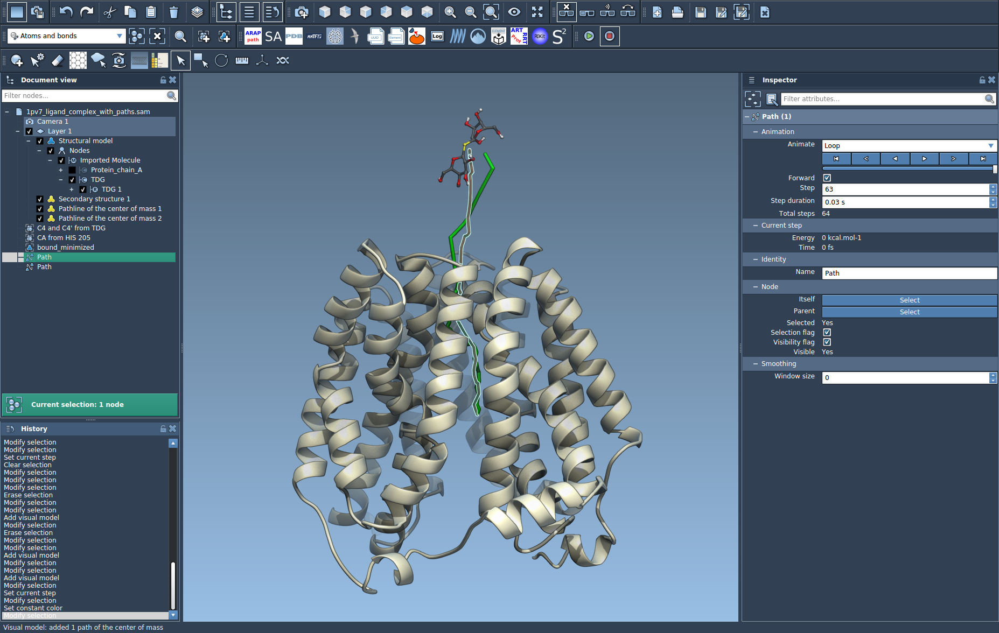

# Pathlines SAMSON Extension

This SAMSON Extension provides a visual model for a pathline of the center of mass of selected nodes based on paths. Pathlines might be useful to visualize a movement of an atom or a center of mass of atoms along a path.

This SAMSON Extension can be added from [SAMSON-Connect](https://www.samson-connect.net): [Pathlines](https://www.samson-connect.net/extensions/d319e2f3-0afc-07ab-0b64-71eb19d7ee2f)

See the [Pathlines tutorial](https://documentation.samson-connect.net/tutorials/pathlines/pathlines/) to learn how to use this SAMSON Extension.
